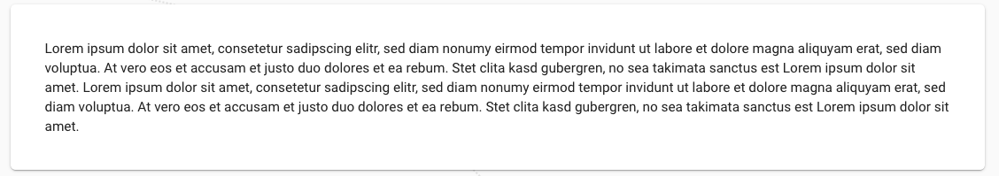

# ComponentFactory

- transforms predefined JSON data into React-Components

---

# External Components

## HeaderAndText:

- supports multiple lines of text
```
  json: {
      header: {
          text: string
          variant: Typography-Variant (like: h2, h3, h4, h5...),
          color: string (primary, secondary, default...)
      },
      texts: string[]
  }
```


---
## TextComponent:

- supports multiple lines of text
```
  json: {
      texts: string[],
  }
```


---
## HeaderTextButton:

- supports multiple lines of text
```
  json: {
      header: {
          text: string
          variant: Typography-Variant from material-ui (like: h2, h3, h4, h5...),
          color: string (primary, secondary, default...)
      },
      texts: string[],
      button: {
          variant: Button-Variant from material-ui (like: outlined, fab ...),
          text: string,
          color: string (primary, secondary, default...)
      }
  }
```


---
## AvatarCards:

```
  json: {
      avatarCards: [
        {
          src: string, (link to image or /assets/...)
          backgroundColor: string (#hex),
          text: string,
          textColor: string (#hex),
          textVariant: Typography-Variant from material-ui (like: body1, body2 ...)
        }
      ]
  }
```


